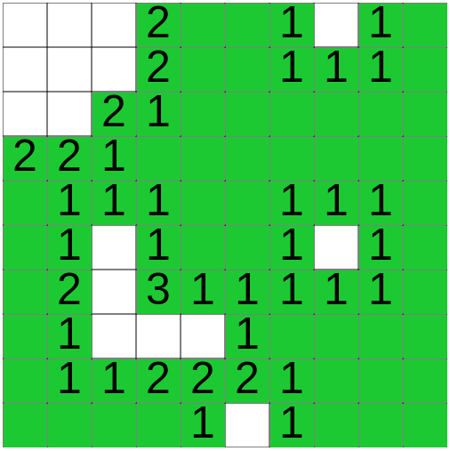
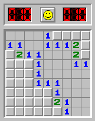
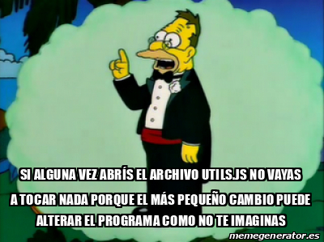

# TP - Buscaminas

## Introducción
En este trabajo estaremos programando un juego similar al clásico Buscaminas (si no lo conocés podés probarlo [acá http://buscaminas.eu/](http://buscaminas.eu/) ). 

<center>
	
	
</center>

Como el desarrollo de este juego involucra temas que aún no trabajamos, algunas partes del juego ya te las daremos resueltas y sólo deberás hacer lo que iremos pidiendo más adelante.


## ¿Cómo copio el código para empezar a trabajar?
**A.** Para copiar el código que te damos hecho tenés que ingresar acá https://repl.it/ e iniciar sesión con tu cuenta.

**B.** Si alguno de tus compañeros YA creó el proyecto para trabajar con este TP, solo debés abrirlo y empezar a trabajar.

**CONTINUAR CON LOS PASOS A CONTINUACIÓN SOLO SI NINGÚN COMPAÑERO DE TU GRUPO CREO EL PROYECTO**

**C.** Si estás en este punto es porque ningún compañero de tu grupo creó el proyecto, en ese caso tenés que seguir [este video](https://web.microsoftstream.com/video/b026685c-5f33-457e-a940-67007ddab0b0?st=106). **El link del repositorio que necesitás para esta actividad es: https://github.com/smschachtner/AP3-BuscaminasP5.git**

**D. No te olvides de invitar a los compañeros de tu grupo**. Para hacer esto debés hacer click en share y buscar los usuarios de sus cuentas, o hacer click en `copy link` y compartírselos.

**E. Compartile el proyecto a tu profesor así lo puede corregir**. Para hacer esto debés hacer click en share y buscar la cuenta de tu profesor. Para **3º B** es **JoaquinBlanco**  y para **3º D** es **smschachtner**.

**F.** Por último te pedimos que le **cambies el nombre al proyecto** así están todos ordenados y los podemos encontrar más fácil.

  Esto se logra haciendo click en el lápiz que está cerca de tu nombre de usuario en `repl.it` (arriba a la izquierda en la pantalla).
      
  Los nombres de los proyectos tienen que ser así: `xxxx-AP3-Gyy-TPzz`
      
  Donde `xxxx` corresponde al año, `yy` es el número de grupo y `zz` es el número de TP.
    
Por ejemplo, para el TP 3 del grupo 5 sería: 2020-AP3-G05-TP03

## El proyecto que copié tiene varios archivos... ¿Tengo que conocer todos?
**No, sólo tenés que trabajar en `main.js` y `respuestas.md`**... pero a continuación te contamos los detalles de cada uno.

- `main.js`: es el archivo de código principal, acá vas a tener que ir resolviendo el código que te pidamos.
- `respuestas.md`: es un archivo de texto donde tenés que responder los puntos que sólo hacen preguntas y NO piden código.
- `README.md`: es este archivo que estás viendo, donde está el enunciado. Te recomendamos que NO lo abras desde `repl.it`porque puede hacer que se vea mal, conviene accederlo directamente desde el link que te damos en la tarea de Teams.
- Carpeta `img`: ahí pusimos las imágenes que usa el programa.
- `utils.js`: en este archivo es donde los profes pusimos el código que ustedes no deben resolver, por lo tanto **NO tenés que modificarlo y recordá el consejo que le dió el abuelo a Homero el día de su casamiento.**

<center>
  
</center>

## Herramientas utilizadas
Los siguientes procedimientos/funciones de P5 te serán útiles para la resolución del TP.

**Te recomendamos que los tengas en cuenta antes de empezar a resolver esta actividad.**

- Esctructura básica de un programa:
    - setup()
    - draw()

- Funciones/procedimientos resueltos por los profes:
    - ponerMinaCasillero(columna, fila)
    - tieneMinaCasillero(columna, fila)
    - pintarCasillero(columna, fila, color)
    - descubrirCasillero(columna, fila)
    - ganar()
    - perder()

- Otros:
    - random()
    - floor()
    - console.log()

# Resuelva
**Utilice comentarios e indentación.**

1. Queremos controlar si el jugador perdió el juego. El jugador pierde cuando hace click con el botón **izquierdo** del mouse en un casillero que tiene una mina. Si sucede esto se debe ejecutar el procedimiento `perder()` que ya existe en tu programa (no hace falta pero si querés mirar su código está en el archivo `utils.js`).

    <details>
      <summary>AYUDA: ¿Cómo puedo saber cuando hicieron click con el mouse?</summary>
      En tu programa ya te damos una variable boolean (esas que sólo tienen 2 valores) llamada `hizoClick` que valdrá `true` (verdadero) en caso que SI se haya hecho click con el mouse y `false` (falso) si NO se hizo click con el mouse.
    </details>

    <details>
      <summary>AYUDA: ¿Cómo hago preguntas en el código?</summary>
      Usando condicionales, los conocidos `if`.

      Ejemplo:
      ```js
      if( aca_va_una_o_varias_condiciones )
      {
        //acá va lo que tiene que pasar si se cumple la condición
      }
      else
      {
        //acá va lo que tiene que pasar si NO se cumple la condición
      }
      ```
    </details>

    <details>
      <summary>AYUDA: ¿Cómo puedo saber con qué botón del mouse hicieron click?</summary>
      Para eso ya existe una variable llamada `mouseButton` que valdrá `LEFT` en caso de haber hecho click con el botón **izquierdo** o valdrá `RIGHT` en caso de haber hecho click con el botón **derecho**.
      
      Recordá que para preguntar si hicieron click con el botón izquierdo o derecho vas a tener que usar esta variable en una condición.
    </details>

    <details>
      <summary>AYUDA: ¿Cómo se si en el casillero que hicieron click había una mina?</summary>
      Para eso ya existe una función llamada `tieneMinaCasillero()` que recibe como parámetros la columna y la fila en la que se quiere averiguar si hubo una mina y entregará/retornará como resultado un `boolean`, es decir `true` cuando haya una mina en ese casillero; y `false` en caso contrario.

      Ejemplo:
      ```js
      if(tieneMinaCasillero(3, 0))
      {
        //Acá van las instrucciones que se deben ejecutar si hay una mina en la columna 3, fila 0.
      }
      else
      {
        //Acá van las instrucciones que se deben ejecutar si NO hay una mina en la columna 3, fila 0.
      }
      ```

      **Si te preguntás cómo es que existe una fila cero, empezá a acostumbrarte porque los programadores SIEMPRE cuentan desde el cero...** más adelante veremos por qué. Esto hace que el casillero de arriba a la izquierda se encuentre en la columna 0, fila 0.
    </details>


    <details>
      <summary>AYUDA: ¿Cómo se en qué casillero hicieron click?</summary>
      Para eso ya existen las variables `columnaPresionada` y `filaPresionada` que te indican en qué columna y fila está el casillero en el que se hizo click.
    </details>


2. Lo próximo que queremos hacer es probar si lo que hicimos en el punto anterior funciona. Para eso necesitamos tener al menos una mina en el tablero para hacerle click.

    <details>
      <summary>AYUDA: ¿Como poner una mina?</summary>
      Podés utilizar el procedimiento `ponerMinaCasillero(columna, fila)` para ubicar una mina en el casillero de la columna y fila indicadas.

      Ejemplo de uso:
      ```js
      ponerMinaCasillero(4, 5); //pone una mina en la columna 4, fila 5
      ```
    </details>


    <details>
      <summary>AYUDA: ¿Dónde tengo que ejecutar ese procedimiento?</summary>
      Depende de cuando y cuantas veces querés que se ejecute:
      
      - Si querés que se haga **una sola vez y al principio del programa**, deberías ejecutarlo en alguna parte del **`setup()`**. **¡Si, igual que en Arduino!**
      
      - Si querés que se **repita y otra vez hasta que el programa termine**, deberías ejecutarlo en alguna parte del **`draw()`**. **El `draw()` sería el equivalente al `loop()` de Arduino**
    </details>


3. Verifique el funcionamiento del punto anterior haciendo click en un casillero donde SI haya una mina.

    Si todo anduvo bien, al hacer click en un casillero con una mina deberías ver una imagen indicando que perdiste el juego (Game Over).

    <details>
      <summary>AYUDA: Estoy haciendo click donde debería estar la mina pero no pierdo el juego...</summary>
      ¿Estás seguro que hiciste click donde pusiste la mina?
      
      Recordá que las filas y columnas se **empiezan a contar desde cero**. Esto hace que el casillero de arriba a la izquierda se encuentre en la columna 0, fila 0.
    </details>


4. Ahora queremos empezar a desarrollar el comportamiento para cuando los jugadores hagan click en un casillero donde NO hay una mina.

    En este caso se debe ejecutar el procedimiento `descubrirCasillero()` que se encarga de hacer varias cosas (descubrir o mostrar ese casillero, poner un número indicando cuantas minas hay en los casilleros de al lado, etc.). Este procedimiento recibe dos parámetros: la columna y la fila del casillero que se desean "descubrir".

    Modificá tu código para que al hacer click izquierdo en un casillero SIN minas, se ejecute el procedimiento `descubrirCasillero()`.


5. El juego buscaminas permite marcar un casillero donde el jugador cree que hay una mina, para esto debe hacer click derecho sobre el casillero. Si querés podés probarlo [acá http://buscaminas.eu/](http://buscaminas.eu/).

    Queremos imitar este comportamiento pintando ese casillero de un color especial, por ejemplo el color guardado en la variable `COLOR_CASILLERO_MARCADO`. Esta variable ya fue creada, solo debés usarla junto con el procedimiento `pintarCasillero()`

    <details>
      <summary>AYUDA: ¿Como pinto un casillero de un color?</summary>
      
      Para eso ya existe una función llamada `tieneMinaCasillero()` que recibe como parámetros la columna y la fila en la que se quiere averiguar si hubo una mina y entregará/retornará como resultado un `boolean`, es decir `true` cuando haya una mina en ese casillero; y `false` en caso contrario.

      Ejemplo, la siguiente instrucción pinta el casillero la columna 3, fila 0, con el color almacenado en la variable `COLOR_CASILLERO_MARCADO`:

      ```js
        pintarCasillero(3, 0, COLOR_CASILLERO_MARCADO);
      ```
    </details>


6. Ahora queremos que nuestro programa detecte cuando el jugador ganó el juego, resolveremos esto en los próximos puntos.

    En el programa ya se declaró una variable llamada `casillerosSinDescubrir` que obviamente contiene la cantidad de casilleros que aún NO fueron descubiertos (los que no se les hizo click).

    Suponga que el tablero del juego tiene 5 columnas y 5 filas: ¿cuál debería ser el valor de la variable `casillerosSinDescubrir` al **inicio del juego**?

    <details>
      <summary>¡AYUDA!</summary>
      
      Al empezar el juego la cantidad de casilleros sin descubrir es igual a la cantidad de casilleros que hay en el tablero (ya que aún no se hizo click en ninguno).
    </details>


7. Una constante es similar a una variable pero la constante tendrá un valor que será FIJO a lo largo de todo el programa, es decir, este valor NO puede modificarse.

    En su programa ya se declaró una constante llamada `COLUMNAS` y otra llamada `FILAS`
    que guardan la cantidad de columnas y filas que tiene el tablero.

    Utilice estas constantes para asignar el valor que debe tener la variable `casillerosSinDescubrir` al inicio del juego. ¿En que procedimiento/función tendría que asignar este valor?

    <details>
      <summary>¡AYUDA!</summary>
      
      Si se quiere asignar un valor a la variable `casillerosSinDescubrir` **al inicio del juego**: ¿la asignación se debe hacer en el `setup()` o en el `draw()`?
    </details>


    <details>
      <summary>¡Más AYUDA!</summary>
      
      Recordá que tenés que usar las constantes `COLUMNAS` y `FILAS`, por lo tanto **hacer lo siguiente NO sería correcto**:

    ```js
    casillerosSinDescubrir = 10 * 10;
    ```
    </details>


8. Ahora queremos encontrar la condición que nos permita saber cuando el jugador ganó el juego. 
    
    Tenga en cuenta que ya se declaró una constante llamada `CANTIDAD_MINAS` que guarda la cantidad de minas que se deben ubicar en el tablero.

    ¿Cuánto debe valer la variable `casillerosSinDescubrir` para darnos cuenta que el jugador ganó el juego? 
    <details>
      <summary>AYUDA</summary>
      
      Cuando se gana el juego: ¿la variable `casillerosSinDescubrir` debe ser **mayor, igual o menor** a la constante `CANTIDAD_MINAS`?
    </details>


9. Considerando la respuesta del punto anterior, completá la definición de la función `ganoElJuego()`.

    Esta función debe entregar/retornar un `boolean`, es decir `true` cuando se cumpla la condición para ganar; y `false` en caso contrario.

    <details>
      <summary>AYUDA: ¿Cómo definir una función en P5?</summary>

      Observá tu código, en el archivo `main.js` vas a encontrar algo así:
    
      ```js
      function ganoElJuego()
      {
        return false;   //Esto hace que NUNCA gane el juego. Modificar/completar
      }
      ```

      Modificá el código anterior para cumplir con lo pedido.

      Te damos un ejemplo de la definición de una función que retornará `true` si la persona es mayor de edad (si tiene 18 años o más) o `false` en caso contrario.
      
    ```js
    function esMayorDeEdad(edad)
    {
      if (edad >= 18)
        return true;
      else
        return false;
    }
    ```

      **El mismo resultado pero más cortito:**
    ```js
    function esMayorDeEdad(edad)
    {
      return (edad >= 18);
    }
    ```
    </details>


10. Ahora que ya definimos esa función, debemos pensar donde la vamos a utilizar.

    ¿En que parte del programa se debería ejecutar la función anterior?

    <details>
      <summary>AYUDA: ¿Dónde debería ejecutar la función?</summary>

      Piense si es necesario que la pregunta para saber si se gano el juego se ejecute:
      
      - Una vez y al principio: `setup()`
      - Varias veces a lo largo del juego: `draw()`.
          - ¿La pregunta se debe hacer luego de haber hecho click en algún casillero?
          - ¿Click izquierdo o click derecho?
          - ¿La pregunta se hace si había una mina en ese casillero o si NO había una mina en ese casillero?
    </details>


11. Teniendo encuenta lo respondido en el punto anterior deberá utilizar/ejecutar la función donde corresponda, utilizando  una pregunta/`if` para que en caso de que la función retorne `true` (indicando que se ganó el juego), luego se ejecute el procedimiento `ganar()`. Ese procedimiento se encarga entre otras cosas de terminar el juego y mostrar una imagen al ganador, pero ya fue desarrollado/definido, por lo tnato solo tenés que ejecutarlo. 


12. Ahora que avanzamos bastante necesitamos un procedimiento que se encargue de poner varias minas en el tablero para que podamos jugar.
    
    Las minas deben ser ubicadas en posiciones al azar. Recuerde que la constante `CANTIDAD_MINAS` (que ya fue declarada) contiene la cantidad de minas que se deben ubicar en el tablero.

    Completá la definición del procedimiento `ponerMinasTablero()` para que cumpla con lo pedido. 

    <details>
      <summary>AYUDA: ¿Cómo obtengo números al azar?</summary>
      La función `random(minimo, maximo)` entrega como resultado un número al azar entre el mínimo y el máximo (menos 1) que se le pasan como parámetro.
      Esta función entrega un resultado con decimales, por lo tanto suele ser conveniente utilizarla con `floor(numero)` que desprecia o trunca lo que está después de la coma.

      Ejemplo de uso de `random()` y `floor()`:
      
      ```js
      numeroAleatorio = floor(random(0, 100));   //numeroAleatorio tendrá un número al azar entre 0 y 99
      ```
    </details>

    <details>
      <summary>MÁS AYUDA: ¿Como poner una mina?</summary>
      Esto ya fue explicado en uno de los primeros puntos del TP. Revisá las ayudas de los ejercicios anteriores.
    </details>

    <details>
      <summary>MÁS AYUDA: Ya pusiste una mina... ¿Cómo poner varias?</summary>
      En JavaScript (y la mayoría de lenguajes) existe lo que se conoce como el `for` que permite **repetir** varias veces un conjunto de instrucciones.

      Ejemplo de uso del for:
      ```js
      for (let contador = 0; contador < 20; contador++)
      {
        //las instrucciones que ponga acá se repetirán 20 veces
      }
      ```
    </details>

    <details>
      <summary>¡LA ÚLTIMA AYUDA: No poner varias minas en el mismo casillero!</summary>
      La función `tieneMinaCasillero(columna, fila)` entrega un boolean (`true` o `false`) como resultado para saber si el casillero de la columna y fila indicada tiene una mina.

      Ejemplo de uso:
    ```js
      if(tieneMinaCasillero(4, 5))
      {
          //esto se ejecuta si la columna 4, fila 5 tiene una mina
      }
      else
      {
          //esto se ejecuta si la columna 4, fila 5 NO tiene una mina
      }
    ```
    </details>


13. Ahora que definiste/desarrollaste el procedimiento anterior, es momento de usarla/ejecutarla.

    Ejecutá el procedimiento `ponerMinasTablero()` donde corresponda.

    <details>
      <summary>AYUDA: ¿Dónde tengo que ejecutar ese procedimiento?</summary>

      ¿Las minas se ponen al **una vez y al principio** del juego o hay que **agregar minas nuevas todo el tiempo**?

      ¿`setup()` o `draw()`?
    </details>


14. En el punto 2 de este trabajo habíamos agregado una mina para ir probando nuestro programa, como ya estamos usando el procedimiento `ponerMinasTablero()` ya NO necesitamos la ejecución del punto 2.

    Si hasta ahora no lo hiciste, borra o dejá como comentario la ejecución del punto 2.


15. Ahora que ya pusimos las minas en el tablero necesitamos un procedimiento que se pueda usar para pintar de un color todos los casilleros que tenían minas.

    Ese procedimiento nos puede servir por ejemplo, al perder, para mostrarle al jugador donde estaba el resto de las minas. 

    Completá la definición del procedimiento `mostrarMinas()` para cumplir con lo pedido.

    <details>
      <summary>AYUDA: ¿Cómo saber si un casillero tiene una mina? ¿Cómo pintar el casillero de un color?</summary>
      No te olvides que en ayudas anteriores te enseñamos como hacer ambas cosas.
    </details>

    <details>
      <summary>AYUDA: ¿De qué color pinto a los casilleros que tienen minas?</summary>
      Podés pintarlo del color que quieras, pero te recomendamos usar la variable `COLOR_CASILLERO_CON_MINA` que ya tiene un color para esto.
    </details>

    <details>
      <summary>AYUDA: ¿Cómo hago para buscar minas en el tablero?</summary>
      Una estrategia sería recorrer **cada casillero** preguntando si ahí hay una mina.
    </details>

    <details>
      <summary>AYUDA: ¿Cómo puedo saber si hay una mina en **un** casillero?</summary>
      Ya lo mencionamos en una ayuda de los puntos anteriores...
    </details>

    <details>
      <summary>AYUDA: ¿Cómo hago para recorrer todo el tablero?</summary>
      Primero podrías agarrar la primera fila y recorrer todos sus casilleros usando un `for` o algún otro ciclo/lazo/bucle.

      Después podés usar otro `for` para repetir TODO lo que hiciste antes, pero cambiando a la segunda fila, la tercera y así...
    </details>

    <details>
      <summary>AYUDA: Listo, ya definí el procedimiento... ¿Dónde se usa/ejecuta?</summary>
      De eso ya nos encargamos los profes. En el archivo `utils.js` nos encargamos de ejecutar ese procedimiento cuando el juego termina.
    </details>


16. Ya que estamos terminando queremos verificar que hasta acá la mayor parte de nuestro juego funciona correctamente.

    Para esto vamos a modificar nuestro juego para que sea fácil ganar, por lo tanto revisá tu archivo `main.js` y modificá la constante `CANTIDAD_MINAS` para que sólo haya 1 mina en el juego.

    Esto permite que la mayoría de veces se pueda ganar el juego haciendo 1 sólo click.

    **¿Te deja ganar "fácilmente"? ¿Aparece una sola mina en el juego?**

    Si algo de esto no ocurre, revisar la ayuda...

    <details>
      <summary>AYUDA: Hay algo que está mal o no funciona como esperaba</summary>
      Revisá las ayudas que dimos en los puntos anteriores (desde que arrancamos con el `ponerMinasTablero()`)
    </details>


    <details>
      <summary>AYUDA: Ya revisé por todos lados, el código, las ayudas y hasta debajo de la cama...</summary>
      Compartile el código a tu profe y contale de qué se trata el problema que estás teniendo.
    </details>


17. Ahora queremos probar cómo se comporta el juego al perder, por este motivo vamos a modificarlo para hacer que ganar sea casi imposible.
    
    Para lograr esto revisá tu archivo `main.js` y modificá la constante `CANTIDAD_MINAS` para que sólo haya 1 casillero libre en el juego.

    Esto se logra haciendo que la constante `CANTIDAD_MINAS` tenga como valor `FILAS * COLUMNAS - 1`

    **¿Se pierde casi "siempre"? ¿Aparece un solo casillero libre en el tablero?**

    Si algo de esto no ocurre, revisar la ayuda...

    <details>
      <summary>AYUDA</summary>
      Te damos las mismas recomendaciones que en el punto anterior y un poco de paciencia porque cuando se aprende a programar es difícil que las cosas funcionen perfecto al primer intento.
    </details>


18. Para ayudar a los jugadores del buscaminas, cuando se descubre un casillero que no tenía mina, se debe indicar con un número la cantidad de minas que hay en los 8 casilleros que están alrededor.

    Completá la definición de la función `contarMinasAlrededor()` para que retorne el número de minas que hay en los casilleros adyacentes.

    <details>
      <summary>AYUDA: Listo, ya definí el procedimiento... ¿Dónde se usa/ejecuta?</summary>
      De eso ya nos encargamos los profes en el archivo `utils.js`.
    </details>

19. Ya que finalizamos el juego ahora sólo queda probarlo, jugalo varias veces, probá todas las opciones que fuimos agregándole y anotá todos los errores que encuentres.